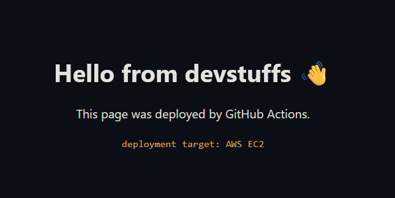

## Deploying To EC2 Steps

- create ec2 instance and download your private key
- place key, user and host in github secrets
- use ssh to connect and run series of commands to set up, deploy

## Upon success



## Some Issue Encountered

### ssh Host key verification failed

Its because by default Github Runners don't have `~/.ssh/` you have to create yourself:
```bash
mkdir -p ~/.ssh
echo "$KNOWN_HOSTS" > ~/.ssh/known_hosts
```

> [!NOTE]
> You may want to pass `KNOWN_HOSTS` as secrets if you treat as secrets. It is actually the result of following command:
> ```bash
> ssh-keyscan -H <host> # for host key, username is not needed
> ```
> The `-H` flag hashes instead of plain text.

You could have generated right from the runner and put it on `~/.ssh/known_hosts` but if you are treating it as secret, you generate it from trusted machine/infrastructure. This prevents MITM attack (DNS spoofing or else) because malicious attacker can act on behalf of `<host>` when you generate on the fly or disable which is not recommended:
```bash
# not recommended
ssh -o StrictHostKeyChecking=no user@host
```

### scp path canonicalization failed

This happens when remote path doesn't exist while trying to copy files from local to remote. For example:
```bash
scp -r /local/path/user_folder user@remote_host:/remote/path/
```

If `/path/to/dest` doesn't exist, the error occurs as:
```
scp path canonicalization failed
```

> The "path canonicalization failed" error occurs because modern versions of OpenSSH (starting from version 9.0) use the SFTP protocol by default for file transfers instead of the legacy SCP protocol. Under the stricter SFTP backend, the destination directory must already exist on the remote server before you can copy files into it recursively.

So, you have three options:
#### 1. Bypass and use legacy algorithm (`-O`)
```bash
scp -O -r /local/path/user_folder user@remote_host:/remote/path/
```

#### 2. Create remote path/dir first:
```bash
# first make sure path is there (use ssh)
ssh user@remote_host "mkdir -p /remote/path/"
# then scp with modern algorithm (drop -O)
scp -r /local/path/user_folder user@remote_host:/remote/path/
```

#### 3. Use `rsync` with `ssh` instead
```bash
rsync -avz -e "ssh -i key.pem" _site/ "${EC2_USER}@${EC2_HOST}":html/
```

## Pseudo-terminal will not be allocated because stdin is not a terminal

In automated scripts where you don't have interactive option, disable the warning (`-T`):
```bash
ssh -T -i key.pen user@remote_host
```

If you need interactivity:
```bash
# Force a TTY allocation
ssh -t user@hostname "sudo apt update"

# Force it even if you are nesting scripts or don't have a local TTY
ssh -tt user@hostname "remote_command"
```

## Github Secret Masking

While you want Github Secret on `stdout` or Github Summary, it's masked by default. If you want anything like that, you have to change your mindset:
- Anything which is logged can't be secret (why log secret?)
- Anything which is logged should not be secret, pass as variable instead

That's why for this:
```yaml
- name: Write Multi-line Summary
shell: bash
run: |
    # EOF is unqoted to access $EC2_HOST
    cat << EOF >> "$GITHUB_STEP_SUMMARY"
    ### 🚀 Deployment Status

    | Deployed To | ACCESS AT |
    | ----------  | --------- |
    | AWS EC2     | [http://$EC2_HOST](http://$EC2_HOST) |
    
    **Click the URL to access application.**
    EOF
```
I use `EC2_HOST` as variable and not secret. Well that makes sence becasue it's the host you want public to acess then there is no reason to keep as secret. If it is meant to be private then you distribute hostname via other mechanism, you don't say alound in Github Summary.